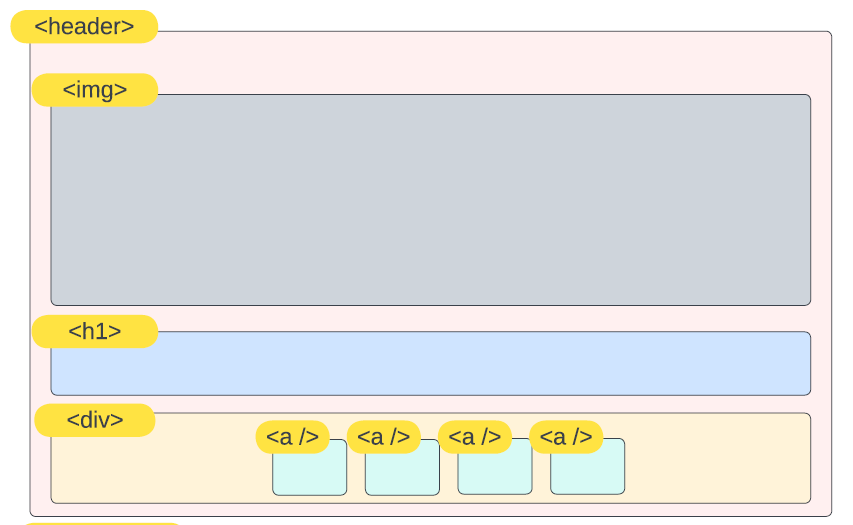

# Translate a design
An assignment about analyzing a design into HTML elements and CSS styling

## The theory
So now you know how every webpage is build around HTML skeleton. You also know that HTML element acts like containers ofr each other. And it's more like building a house - You know, a giant ass box with rooms/boxes inside with more cabinets/shelfs/boxes etc. 

A part of building a website from a designers vision is to be able to analyse this design for.. well.. boxes. 

Every HTML element has a purpose some is obvious. You wouldn't put a `<footer></footer>` at the top of your page for example. Some needs an extra look in the documentation to fully get. 

Now you are starting out I will show you a tool you can use to analyze the design - we call this wireframing. And it's - you guessed it - drawing boxes and naming them. It's a visual rendition of the HTML document. 

An example on how to translate these boxes from design to wireframe to HTML.




The code example: 
```
<header>
    
    <h1></h1>
    <div>
        <a href=""></a>
        <a href=""></a>
        <a href=""></a>
        <a href=""></a>
    </div>
</header>

```
Whenever there is three dots `...` in the wireframe it means that the element can be copied and repeated the number of times it's relevant.

in the file `theory.html` is a more thorough explanation of the HTML syntax that might come in handy so I suggest you read it thorugh. 

## The assignment
A designer has approached you with a design for a CV/resume `resume-with-style.pdf` they want as a website. You job is to build this website using HTML and CSS. You have a benevolent boss (that's me) that has already given you the wireframe `resume-html-elements-frame.pdf` AND a document showing you how the website should look with only HTML (BEFORE! you make the CSS styling) `resume-no-style-pdf`.

The wireframe shows you whitch element goes where and is within each other. So your job is following:

* Make a new repository on github called `resume`
* Clone the repository to VS Code - save the location for the repository in you `codeprojects` folder next to your `visitkort` project.
* Create an `index.html` file in your resume project in VS Code
* Type `!` and press enter in your index file
* Then write the HTML elements as they are in the wireframes 
* Then write content in your HTML elements (you can make up content or use the [lorem ipsum text examples](https://www.lipsum.com/) )


**REMEMBER that the finished HTML should look like `resume-no-style.pdf`**

## BONUS Assignment
**For those of you absolutely insisting on finnishing a 10 week course i 1 week ;)**

Use what you have learned in CSS so far to make your webpage look like the original `resume-with-style.pdf`. You will need a lot of flexbos properties so if you haven't already then finish the [Flexbox Froggy](https://flexboxfroggy.com/#da) game before you start this bonus assignments. 

Otherwise here is a list of helpful links you can scope out to finish the assignment:
* [Visual overview of flexbox properties](https://cssreference.io/flexbox/)
* [Visual overview of boxmodel properties](https://cssreference.io/box-model/) - These are height, width, padding etc. 
* [Visual overview of typography properties](https://cssreference.io/typography/)
* [a guide to css selectors](https://developer.mozilla.org/en-US/docs/Learn/CSS/Building_blocks/Selectors) - Classes, elements etc.


