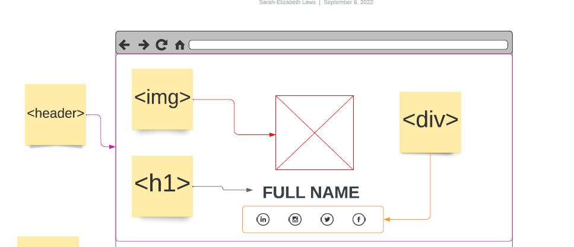

# Translate a design
An assignment about analyzing a design into HTML elements and CSS styling

## The theory
So now you know how every webpage is build around HTML skeleton. You also know that HTML element acts like containers ofr each other. And it's more like building a house - You know, a giant ass box with rooms/boxes inside with more cabinets/shelfs/boxes etc. 

A part of building a website from a designers vision is to be able to analyse this design for.. well.. boxes. 

Every HTML element has a purpose some is obvious. You wouldn't put a `<footer></footer>` at the top of your page for example. Some needs an extra look in the documentation to fully get. 

Now you are starting out I will show you a tool you can use to analyze the design - we call this wireframing. And it's - you guessed it - drawing boxes and naming them. It's a visual rendition of the HTML document. 

An example on how to translate these boxes from design to wireframe to HTML.




The code example: 
```
<header>
    
    <h1></h1>
    <div>
        <a href=""></a>
        <a href=""></a>
        <a href=""></a>
        <a href=""></a>
    </div>
</header>

```

Besides a wireframe you will also see a styleguide. This is a guide of the design for the webpage. These may contain the color codes, the font styles and sizes and icons or even how parts of the design like the menu should look like. It's expected that you adhere to these styleguides strichtly. As a wwebdeveloper you do NOT design the webpages (except your own projects) your most important job is to translate the abstract vision of the designer into a interactive, functional webpage by bringing system to creativity. That in it self may require a level of creativity and that's why you need all the image and compositions analysis learned in langauage and art classes in school. 

Though you are rarely left to fend for your self in this translation of the design. This is where wireframes and styleguides come in handy. You don't have to waste time matching the color of a given design to find the perfect HEX code. I'ts already given to you. A lot of the wireframe CSS is what you save in your `layout.css` while a lot of the styleguide CSS is saved in `variables.css` and `base.css`.

Besides these handy helpinng documents, you'll often see a specification from the client. This entails all the subpages, functionalities and etc. of the webpage. **Read this thoroughly through** before any project. This might also let you know ehere to find text and images. In any case this is where you'll get most of your questions answered. If not - then this is where you should make sure to ask the client for any further information that you can solve your assignment. 


## The assignment
A client has approach you. They need a new online resumé and they haven't had the time or energy to watch my youtube videos, as they panic over writing enough daily job-applications. So they ask YOU to code the HTML and CSS for this resume. 

They have already provided you with the final design `resume-with-style.pdf` and even how the structure of the HTML whould look without CSS styling `resume-no-style.pdf`. Furthermore they have provided a styleguide `resume-styleguide.pdf` and wireframe `resume-wireframe.pdf`. All the page needs to entail is listed in `resume-kravspecifikation.pdf`. Images for the webpage are found in the `images` folder and the text for the webpage is found in the `texts` folder. 

You now have all the elements you need to make a webpage to the clients exact specification. 

This assignment is strict - you are to follow the designs, texts and images given. You are not to customize or make your own interpretation. Your creativity for this assignment should be how you code and not how you design. 

**The subtasks for this assignment is as follows:**
* Make a new repository on github called `resume`
* Clone the repository to VS Code - save the location for the repository in you `codeprojects` folder next to your `visitkort` project.
* Create an `index.html` file in your resume project in VS Code
* Type `!` and press enter in your index file
* Then write the HTML elements as they are in the wireframes 
* Then write content in your HTML elements - those are found in the `images` and `texts` folder of this assignment
* Then write the CSS for the webpage adhering to the design provided by the client `resume-with-style.pdf` and the styleguide `resume-styleguide.pdf`
* HINT: Does the design look familiar?
* Remember to stage and commit your project frequently
* When finished: make sure your repository on GitHub is set to "public" visibility
* **DO NOT** puplish this webpage it's **NOT** a part of the assignment
* Hand in the assignment as specified by your teacher of the day (this will most likely be specified on a teams post as well)


### Useful links:
* [Flexbox Froggy](https://flexboxfroggy.com/#da) - A game that teaches you flexbox 
* [Visual overview of flexbox properties](https://cssreference.io/flexbox/)
* [Visual overview of boxmodel properties](https://cssreference.io/box-model/) - These are height, width, padding etc. 
* [Visual overview of typography properties](https://cssreference.io/typography/)
* [a guide to css selectors](https://developer.mozilla.org/en-US/docs/Learn/CSS/Building_blocks/Selectors) - Classes, elements etc.


